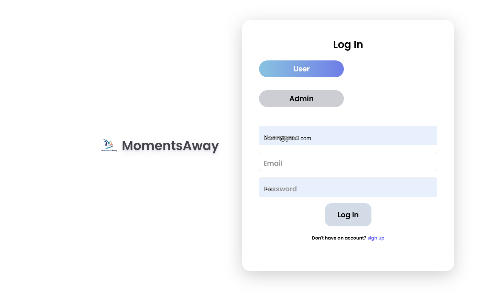
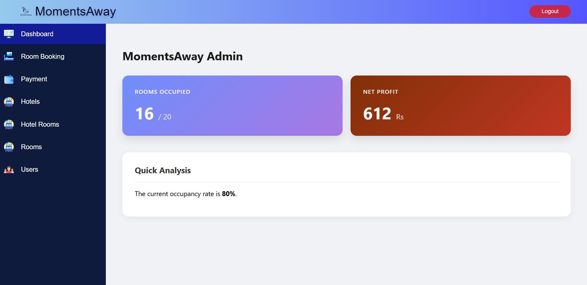
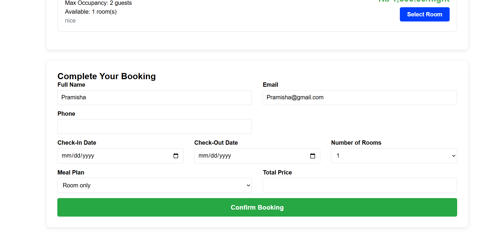
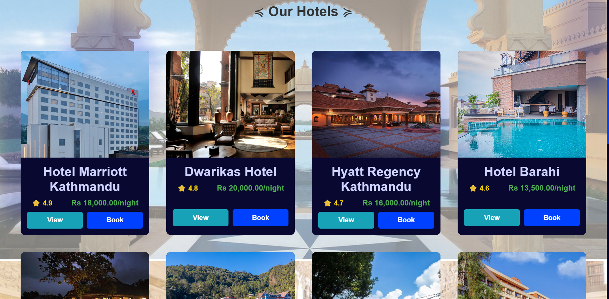

# 🏨 Hotel Reservation System (PHP)

A web-based Hotel Reservation System built using HTML, CSS, JavaScript, and PHP with MySQL database.

## 🚀 Features

- User Registration & Login
- Admin Login
- Room Booking System
- Add / Edit / Delete Rooms (CRUD)
- Admin Dashboard
- Booking Management
- Database Integration

## 🛠 Tech Stack

- Frontend: HTML, CSS, JavaScript
- Backend: PHP
- Database: MySQL
- Server: XAMPP (Apache)

## 📂 Project Structure

Hotel-Reservation-System/
│
├── admin/                  # Admin panel files
├── customer/               # Customer related pages
├── css/                    # Stylesheets
├── javascript/             # JavaScript files
├── image/                  # Project images/assets
│
├── index.php               # Main landing page
├── home.php                # Home page
├── hotel_detail.php        # Hotel details page
├── process_booking.php     # Booking logic processing
├── login.php               # User login
├── logout.php              # Logout functionality
├── config.php              # Database configuration
│
├── momentsawayhotel.sql    # Database file
│
├── home.png                # Screenshot - Home Page
├── booking.png             # Screenshot - Booking Page
├── dashboard.png           # Screenshot - Dashboard
├── hotels.png              # Screenshot - Hotels Page
│
└── README.md               # Project documentation

## ⚙️ How to Run the Project

1. Install XAMPP
2. Place project folder inside `htdocs`
3. Start Apache and MySQL
4. Import the `database.sql` file in phpMyAdmin
5. Open browser and go to:
   http://localhost/Hotel-Management-System

## 🎯 Purpose of the Project

This project was built as a semester project for BCA and demonstrates CRUD operations, backend integration, and database handling using core PHP.

## 📸 Screenshots

### Home Page

### Login Page

### Admin Dashboard

### Booking Page

### Hotels Page

## 👩‍💻 Author

Pramisha  
BCA Student – Tribhuvan University  
Aspiring Developer
